# Hi, I'm Chasing🔮

- 🏫 I'm a CS PhD at the [**Institute of Computing Technology**](http://ict.cas.cn/) of the [**Chinese Academy of Sciences**](https://www.cas.cn/)
- 🔭 My research centers on distributed systems and ML systems, especially training and inference optimization for LLMs.
- 📝 I regularly write articles on my [**Blog**](https://chasing1020.github.io)
- 📫 How to reach me [**chasing1020@gmail.com**](mailto:chasing1020@gmail.com)
- 🐧 [ArchLinux](https://archlinux.org/about/) User | 🎸 [Introverted](https://en.wikipedia.org/wiki/Bocchi_the_Rock!) | 🦉 [Night owl](https://en.wikipedia.org/wiki/Night_owl) | 🎨 [ACG](https://en.wikipedia.org/wiki/ACG_%28subculture%29) fans | 🍺 IP location: [Gensokyo](https://en.touhouwiki.net/wiki/Gensokyo)

<a href="https://ghfind.com/u/chasing1020?ref=badge">
  <picture>
    <source media="(prefers-color-scheme: dark)" srcset="https://ghfind.com/api/card/mini/chasing1020?theme=dark&amp;lang=zh" />
    
  </picture>
</a>

  
📊 GitHub Stats &amp; Activity

   

  <table>
    <tr>
      <th>📈 GitHub Stats</th>
      <th>💻 Top Languages</th>
    </tr>
    <tr>
      <td width="50%" align="center">
        
      </td>
      <td width="50%" align="center">
        
      </td>
    </tr>
    <tr>
      <th>🏆 GitHub Trophies</th>
      <th>⏱ Coding Activity</th>
    </tr>
    <tr>
      <td width="50%" align="center">
        
      </td>
      <td width="50%" align="center">
        
      </td>
    </tr>
  </table>

